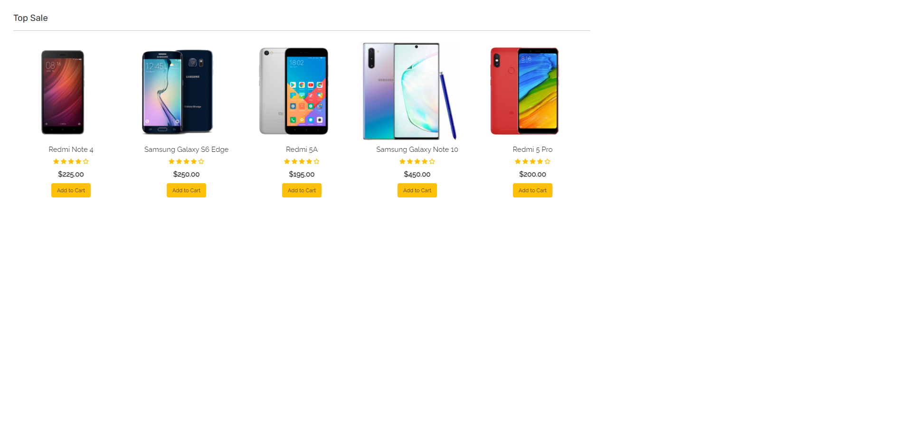

# 
 Mobile Shop 

## Description

It is an e-commerce website project for mobile phones online purchases. The project has been implemented using the following technologies:
* HTML
* CSS and SASS
* PHP
* Javascript and jQuery
* MySQL

To access the website you do not have to be logged into your own account, but to add the products to the wishlist, shopping cart and to order the products you have to be logged in.
The website has two different sides. One of them is for the customers and the other one is only for the admin.

### <i> Customers side </i>
After you have been registered and logged into your account, you can do the following actions:
 * Add and delete products to/from your wishlist
 * Add and delete products to/from your shopping cart
 * Move the products from the wishlist to the shopping cart and vice versa.
 * Select the quantity of the product you want to purchase.
 * See your account details, where you can change your current password
 * See your previous order
 * Search the products, filter by their brand 
 * Change the currency - at the moment you can use only USD, EUR, GBP and RON currencies.

### <i> Admin side </i>
To log into the admin page, you need to enter the required credentials (you can find them in the <a href="functions.php">functions.php </a> page) in the login page. The admin can do the following actions:
 * See all products list, add new products, edit the products already added and delete the products.
 * See all users list and delete them.
 * See all orders list, see order's details (total price, currency, order's products and their quantities) , change the order's status (from Pending to Delivered).

## How does the project looks

If you open the index.php file on browser, you should be able to see something like this:

 The header and some carousel pictures  

 

 The all products section. 

 

 Top Sale section of the website  

 

 Special Price section  

 New Phones sections and the website's footer  

## Credits

Some parts of the costumer side of the website have been realized after watching an e-commerce website using PHP and MySQL tutorial on Youtube. You can find the <a href="https://www.youtube.com/watch?v=KLWA2vCERSQ">tutorial</a> here.

